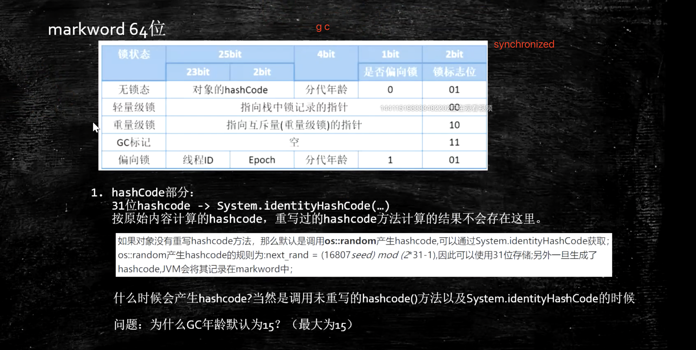
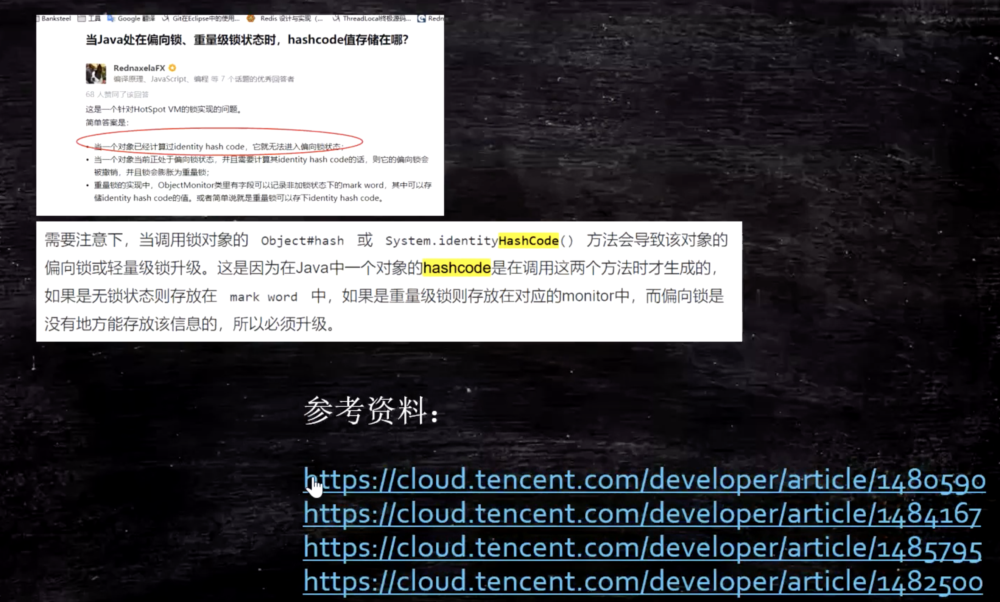
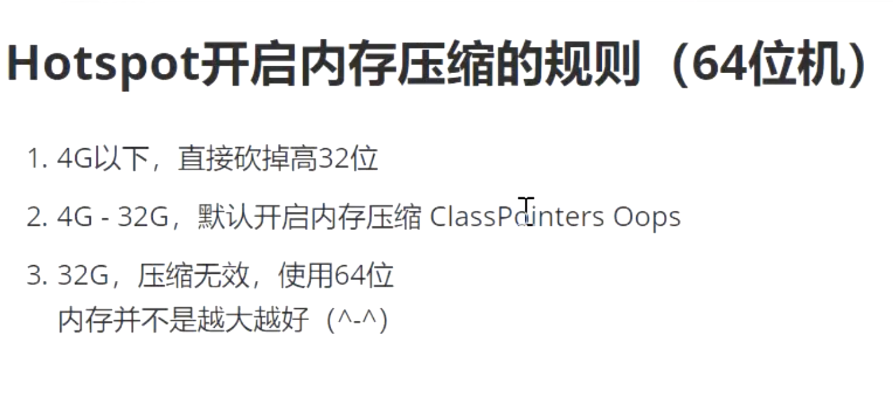

jvm类加载机制
jvm 是一种规范   只要符合规范的文件都可以运行

###   classs     loading         linking           initialization    use   unloading

## loading

对象组成部分（https://blog.csdn.net/qq_40634846/article/details/106314921）
分为普通对象和数组对象
1 对象头(object head三部分组成)

    1.1 Mark Word（不同状态下，内容不同，2bit 锁标志位，4bit gc ，1bit 偏向锁）
        记录对象和锁的有关信息，当一个对象被synchronized加锁之后围绕锁所有的操作都和mark word有关；
        Mark Word 一般是32/64为，保存一些分代年龄，无锁状态下对象的hashCode，偏向锁的线程id，轻量级锁指向栈中锁记录的指针，指向重量锁的指针，锁的标志位等内容；
        Mark Work存储的是对象自身运行时的数据，比如：锁标志位；是否偏向锁；GC分代年龄；对象的hashCode；获取到该锁的线程的线程ID；偏向时间戳（Epoch）等等

    1.2 指向类的指针(class pointers)      -XX:+UseCompressedClassPointers 开启为4字节，不开启为8字节
        大小通常也是32/64bit，主要指向类的数据，也指向方法区中的数据
        Java对象存放在堆中，但其类信息存放在方法区中，所以Klass word指向该对象的类信息。
    1.3 数组长度(array length)
        只有数组对象才有，32bit/64bit 的jvm中长度均为32bit
2 实例数据区(instance data)

    对象的实例数据就是对象在java代码中的属性（包括父类属性以及自己的属性）和值。
    1 引用类型： -XX：+UseCompressedOopss 为4bit 不开启为8bit
                            Oops  Ordinary Object Pointers

3 对齐填充字节(padding)
    
    因为jvm要求Java对象占用内存的大小是8bit的倍数，因此需要把对象的大小补齐至8bit的倍数。

偏向锁中hashcode的存放位置(32位)

hashCode重写过
        没有重写过：markWord中，64bitVM   31bit
                              32bitVM   25bit

Gc默认的年龄是15 因为MarkWord中有4bit来表示，2^4=16（0-15）

对象定位：
    句柄尺：            指针指向一个地址，这个地址分别指向对象和对象引用两部分     gc效率高
    直接引用：HotSpot    hash指向一个地址，地址中ClassPointers指针指向对象       定位快

HotSpot 内存压缩规则

##  GC

### 常用gc算法
    
    1 mark sweep(标记清除算法)
        优势        
            将所有需要回收的内存进行标记，统一进行清除
        缺点
            容易产生内存碎片，碎片太多，导致后续有较大的对象需要分配内存空间时候没有足够的空间而触发新一轮的gc
        需要进行两次查询，不适用于新生代的gc
        
    2 copying(复制算法)
        划分两块相同的区域，每次只使用其中一块，当进行gc的时候将存活的对象复制到另外一块区域，集中回收当前区域
        优点
            这种算法虽然实现简单，运行高效且不容易产生内存碎片
        缺点
            会造成内存空间的浪费，回收算法的效率和对象存活数密切关联，当存活对象很多时候这种方法效率较低
        
    3 mark-compact(标记压缩算法)
        为了解决Copying算法的缺陷，充分利用内存空间，提出了Mark-Compact算法。该算法标记阶段和Mark-Sweep一样，但是在完成标记之后，它不是直接清理可回收对象，而是将存活对象都向一端移动，然后清理掉端边界以外的内存。具体过程如下图所示：
        将存活的对象向边界一端移动，清理掉边界意外的内存
    4 分代回收算法(Generational Collection（)
        依据堆内存中不同区域对象的不同特性采取相适合的算法进行回收
        老年代对象表稳定，采用标记-压缩算法
            
        新生代采用复制算法，因为新生代中每次垃圾回收都需要回收掉大部分对象，也就是说需要复制的对象较少；
            但是实际中并不是按照1:1比例来分配内存空间的，一般划分为比较大的eden空间和两块比较晓得survivor空间，每次使用eden和survivor From空间
            当进行垃圾回收时候将eden和survivor from中还存活的对象复制到survivor To区间，然后清理掉eden和使用过的survivor From空间

#### 垃圾回收时候原理
        root refluce
    

    
    